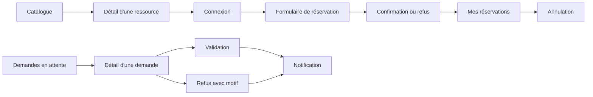

# Dossier d'analyse — L'Escale

## 1. Présentation du projet

L'Escale est un tiers-lieu associatif fictif qui met à disposition de ses
adhérents des ressources partagées : des salles de réunion, un studio
d'enregistrement, un véhicule utilitaire et du matériel empruntable.

Les réservations sont actuellement gérées par e-mail et dans un tableur
partagé. Ce fonctionnement entraîne des doubles réservations, une charge
importante pour l'équipe et un manque de traçabilité des utilisations.

Le projet consiste à développer une application web permettant aux adhérents de
consulter les ressources et d'effectuer leurs réservations, tout en appliquant
automatiquement les règles d'utilisation. L'équipe doit pouvoir administrer le
catalogue, traiter les demandes nécessitant une validation et consulter
l'activité.

## 2. Objectifs

Les objectifs principaux sont :

- éviter les doubles réservations ;
- permettre aux adhérents de vérifier eux-mêmes les disponibilités ;
- faire respecter automatiquement les règles de réservation ;
- réduire les demandes envoyées par e-mail à l'équipe ;
- conserver un historique des actions importantes ;
- proposer une interface utilisable sur ordinateur et téléphone ;
- protéger les données personnelles et les accès selon le rôle de l'utilisateur.

## 3. Périmètre

### 3.1 Fonctionnalités incluses

- authentification et déconnexion ;
- gestion des comptes par l'administrateur ;
- consultation et recherche du catalogue ;
- création, consultation et annulation de réservations ;
- validation ou refus des demandes par un gestionnaire ;
- gestion des ressources et des périodes de maintenance ;
- notifications dans l'application ;
- journal d'activité ;
- tableau de bord gestionnaire si le temps le permet.

### 3.2 Fonctionnalités hors périmètre

- paiement en ligne ;
- gestion des cotisations ;
- application mobile native ;
- gestion des clés et des badges ;
- inscription libre des adhérents ;
- création automatique des comptes adhérents par les utilisateurs.

Les notifications par e-mail et l'export iCalendar sont des fonctionnalités
souhaitables. Elles seront traitées uniquement après les exigences
indispensables et importantes.

## 4. Acteurs et droits

| Acteur         | Description                      | Droits principaux                                                                                                    |
| -------------- | -------------------------------- | -------------------------------------------------------------------------------------------------------------------- |
| Visiteur       | Personne non authentifiée        | Consulter et rechercher le catalogue                                                                                 |
| Adhérent       | Utilisateur inscrit par l'équipe | Réserver, consulter et annuler ses réservations ; consulter ses notifications et ses données                         |
| Gestionnaire   | Membre de l'équipe               | Droits de l'adhérent ; gérer les ressources et maintenances ; valider ou refuser les demandes ; consulter l'activité |
| Administrateur | Responsable de l'application     | Droits du gestionnaire ; créer les comptes ; attribuer ou retirer le rôle de gestionnaire ; désactiver un compte     |

Les contrôles d'accès doivent être effectués côté serveur. Le masquage d'un
bouton dans l'interface ne constitue pas une protection suffisante.

## 5. User stories prioritaires

### US-01 — Consulter le catalogue

**En tant que** visiteur ou utilisateur connecté,  
**je veux** consulter les ressources disponibles,  
**afin de** connaître leur description, leur catégorie et leurs conditions
d'utilisation.

**Priorité :** indispensable.

**Critères d'acceptation :**

- le catalogue est accessible sans authentification ;
- chaque ressource présente une description, une catégorie et ses conditions
  d'utilisation ;
- une photo peut être affichée lorsqu'elle existe ;
- une ressource retirée du catalogue n'est plus proposée comme réservable.

### US-02 — Rechercher une ressource

**En tant que** visiteur ou utilisateur connecté,  
**je veux** filtrer les ressources par catégorie, mot-clé et période,  
**afin de** trouver une ressource adaptée et disponible.

**Priorité :** indispensable.

**Critères d'acceptation :**

- la recherche accepte une catégorie ;
- la recherche accepte un mot-clé ;
- la recherche peut vérifier la disponibilité sur une période ;
- les résultats indiquent clairement lorsqu'aucune ressource ne correspond.

### US-03 — Se connecter

**En tant qu** utilisateur créé par l'équipe,  
**je veux** me connecter et me déconnecter,  
**afin de** bénéficier des fonctionnalités correspondant à mon rôle.

**Priorité :** indispensable.

**Critères d'acceptation :**

- aucune inscription libre n'est proposée ;
- des identifiants invalides sont refusés avec un message explicite ;
- un compte désactivé ne peut pas se connecter ;
- la déconnexion invalide la session.

### US-04 — Réserver une ressource

**En tant qu** adhérent,  
**je veux** demander une ressource sur un créneau,  
**afin de** l'utiliser pendant une période définie.

**Priorité :** indispensable.

**Critères d'acceptation :**

- seuls les utilisateurs autorisés peuvent réserver ;
- les dates et heures sont validées ;
- les règles métier sont contrôlées côté serveur ;
- un chevauchement avec une réservation existante est refusé ;
- deux demandes simultanées ne peuvent pas créer deux réservations
  incompatibles ;
- le système explique la raison d'un refus ;
- une ressource nécessitant une validation produit une demande en attente.

### US-05 — Consulter et annuler ses réservations

**En tant qu** adhérent,  
**je veux** consulter mes réservations à venir et passées et annuler une
réservation lorsque cela est autorisé,  
**afin de** gérer mes utilisations.

**Priorité :** indispensable.

**Critères d'acceptation :**

- un adhérent ne voit que ses propres réservations ;
- les réservations sont séparées entre à venir et passées ;
- l'annulation est refusée lorsque le délai de 24 heures est dépassé ;
- un gestionnaire peut annuler une réservation dans le cadre de ses droits ;
- l'utilisateur reçoit un retour clair après l'action.

### US-06 — Traiter une demande

**En tant que** gestionnaire,  
**je veux** valider ou refuser une demande en attente,  
**afin de** contrôler l'accès aux ressources concernées.

**Priorité :** indispensable.

**Critères d'acceptation :**

- seuls les gestionnaires et administrateurs peuvent traiter une demande ;
- une validation change le statut de la demande ;
- un refus exige un motif ;
- le motif du refus est visible par l'adhérent ;
- une demande non traitée avant le début du créneau est automatiquement
  annulée.

### US-07 — Gérer les ressources

**En tant que** gestionnaire,  
**je veux** créer, modifier, retirer une ressource et déclarer une maintenance,

**afin de** maintenir un catalogue fiable.

**Priorité :** indispensable.

**Critères d'acceptation :**

- seuls les gestionnaires et administrateurs peuvent modifier le catalogue ;
- une ressource peut être associée à une catégorie ;
- une période de maintenance empêche les réservations concernées ;
- les adhérents concernés sont prévenus lorsqu'une maintenance affecte une
  réservation existante.

### US-08 — Gérer les comptes

**En tant qu** administrateur,  
**je veux** créer, désactiver et gérer les rôles des comptes,  
**afin de** contrôler les accès à l'application.

**Priorité :** indispensable.

**Critères d'acceptation :**

- seuls les administrateurs peuvent gérer les comptes ;
- un administrateur peut créer un compte ;
- un administrateur peut attribuer ou retirer le rôle de gestionnaire ;
- un compte désactivé ne peut plus se connecter ;
- les réservations futures d'un compte désactivé sont annulées.

### US-09 — Recevoir des notifications

**En tant qu** utilisateur concerné par un événement,  
**je veux** recevoir une notification dans l'application,  
**afin de** connaître l'état de mes demandes et réservations.

**Priorité :** importante.

**Critères d'acceptation :**

- une notification est créée pour chaque événement prévu ;
- le nombre de notifications non lues est visible ;
- une notification peut être marquée comme lue ;
- un utilisateur ne voit que ses notifications.

### US-10 — Consulter le journal d'activité

**En tant que** gestionnaire,  
**je veux** consulter les actions importantes,  
**afin de** retrouver qui a fait quoi et quand.

**Priorité :** importante.

**Critères d'acceptation :**

- seuls les gestionnaires et administrateurs peuvent consulter le journal ;
- chaque entrée indique l'auteur, l'action, la cible et la date ;
- les entrées sont affichées dans l'ordre chronologique ;
- le journal est conservé pendant la durée définie par le client.

## 6. Règles métier identifiées

| Code | Règle                                                                                                                           |
| ---- | ------------------------------------------------------------------------------------------------------------------------------- |
| R1   | Un adhérent ne peut pas avoir plus de trois réservations à venir par catégorie. Les demandes en attente comptent dans le quota. |
| R2   | Une salle est réservée quatre heures maximum. Le matériel et le véhicule sont réservés trois jours maximum.                     |
| R3   | Une réservation ne peut pas commencer plus de trente jours après la demande.                                                    |
| R4   | Un adhérent peut annuler jusqu'à 24 heures avant le début. Au-delà, seul un gestionnaire peut annuler.                          |
| R5   | Une ressource en maintenance ne peut pas être réservée pendant la période concernée.                                            |
| R6   | Un refus doit comporter un motif visible par l'adhérent.                                                                        |
| R7   | Un compte désactivé ne peut plus se connecter et ses réservations futures sont annulées.                                        |
| R8   | Une demande non traitée avant le début du créneau est automatiquement annulée et l'adhérent est prévenu.                        |

Chaque règle devra être couverte par au moins un test automatisé.

## 7. Questions à poser au client

Les questions suivantes sont volontairement conservées comme questions ouvertes :
elles servent à préparer l'échange avec le client et ne constituent pas des
décisions fonctionnelles.

### Fonctionnement des réservations

| Référence | Question                                                                                                                                                                               | Réponse    | Statut  |
| --------- | -------------------------------------------------------------------------------------------------------------------------------------------------------------------------------------- | ---------- | ------- |
| Q-01      | Une réservation peut-elle se terminer exactement au moment où une autre commence ?                                                                                                     | À demander | Ouverte |
| Q-02      | Une réservation confirmée peut-elle être modifiée ou doit-elle être annulée puis recréée ?                                                                                             | À demander | Ouverte |
| Q-03      | Quelles informations l'adhérent doit-il fournir pour justifier une demande de réservation ?                                                                                            | À demander | Ouverte |
| Q-04      | Le tiers-lieu a-t-il des horaires d'ouverture spécifiques à respecter pour les réservations ?                                                                                          | À demander | Ouverte |
| Q-05      | La limite de trois jours pour le matériel et le véhicule correspond-elle à des jours calendaires ou à 72 heures glissantes ?                                                           | À demander | Ouverte |
| Q-06      | Le matériel peut-il être emprunté et rendu à n'importe quelle heure, ou des créneaux sont-ils imposés ?                                                                                | À demander | Ouverte |
| Q-07      | Lorsqu'une maintenance concerne une ressource déjà réservée, faut-il annuler automatiquement les réservations à venir et notifier les adhérents, ou laisser le gestionnaire arbitrer ? | À demander | Ouverte |

### Ressources et maintenances

| Référence | Question                                                                                                                                        | Réponse    | Statut  |
| --------- | ----------------------------------------------------------------------------------------------------------------------------------------------- | ---------- | ------- |
| Q-08      | Quelles sont les catégories exactes de ressources à proposer au lancement ?                                                                     | À demander | Ouverte |
| Q-09      | Les catégories sont-elles fixes ou administrables par un administrateur ?                                                                       | À demander | Ouverte |
| Q-10      | Quels champs sont obligatoires pour créer une ressource ?                                                                                       | À demander | Ouverte |
| Q-11      | Une ressource peut-elle posséder plusieurs images, et qui peut les gérer ?                                                                      | À demander | Ouverte |
| Q-12      | Une ressource retirée du catalogue doit-elle être désactivée ou supprimée définitivement ?                                                      | À demander | Ouverte |
| Q-13      | Une ressource désactivée reste-t-elle visible dans les réservations passées ?                                                                   | À demander | Ouverte |
| Q-14      | Qui peut créer, modifier, retirer ou réactiver une ressource ?                                                                                  | À demander | Ouverte |
| Q-15      | Quelles informations doivent être saisies pour déclarer une maintenance ?                                                                       | À demander | Ouverte |
| Q-16      | Une maintenance peut-elle être modifiée ou supprimée après sa création ?                                                                        | À demander | Ouverte |
| Q-17      | Les maintenances récurrentes sont-elles nécessaires ou une période unique suffit-elle ?                                                         | À demander | Ouverte |
| Q-18      | Le véhicule et le studio sont-ils les seules ressources soumises à validation, ou cette liste doit-elle être configurable par un gestionnaire ? | À demander | Ouverte |
| Q-19      | Un équipement est-il géré comme un objet unique avec un numéro d'inventaire, ou faut-il gérer des quantités pour un même modèle ?               | À demander | Ouverte |

### Comptes, rôles et droits

| Référence | Question                                                                                                                        | Réponse    | Statut  |
| --------- | ------------------------------------------------------------------------------------------------------------------------------- | ---------- | ------- |
| Q-20      | Quels champs sont obligatoires à la création d'un compte et quelles règles s'appliquent au mot de passe ?                       | À demander | Ouverte |
| Q-21      | Une adresse e-mail doit-elle être vérifiée avant de pouvoir réserver ?                                                          | À demander | Ouverte |
| Q-22      | Qui peut créer, modifier, désactiver et réactiver un compte ?                                                                   | À demander | Ouverte |
| Q-23      | Un gestionnaire peut-il traiter toutes les ressources ou seulement un périmètre donné ?                                         | À demander | Ouverte |
| Q-24      | Que doit voir un visiteur non connecté lorsqu'il tente de réserver ?                                                            | À demander | Ouverte |
| Q-25      | Lorsqu'un adhérent demande la suppression de son compte, ses réservations à venir doivent-elles être annulées automatiquement ? | À demander | Ouverte |

### Notifications et suivi

| Référence | Question                                                                                                              | Réponse    | Statut  |
| --------- | --------------------------------------------------------------------------------------------------------------------- | ---------- | ------- |
| Q-26      | Quels événements doivent générer une notification ?                                                                   | À demander | Ouverte |
| Q-27      | Les notifications sont-elles uniquement visibles dans l'application ou doivent-elles aussi être envoyées par e-mail ? | À demander | Ouverte |
| Q-28      | Une notification doit-elle être marquée comme lue manuellement ou automatiquement à l'ouverture ?                     | À demander | Ouverte |
| Q-29      | Combien de temps les notifications doivent-elles rester visibles ?                                                    | À demander | Ouverte |
| Q-30      | Quelles actions doivent apparaître dans le journal d'activité ?                                                       | À demander | Ouverte |
| Q-31      | Qui peut consulter le journal d'activité et quelles données personnelles doit-il masquer ?                            | À demander | Ouverte |

### Interface, accessibilité et données personnelles

| Référence | Question                                                                                            | Réponse    | Statut  |
| --------- | --------------------------------------------------------------------------------------------------- | ---------- | ------- |
| Q-32      | Le fuseau horaire et le format des dates doivent-ils suivre le site ou le profil de l'utilisateur ? | À demander | Ouverte |
| Q-33      | Quelles tailles d'écran et quels navigateurs doivent être supportés en priorité ?                   | À demander | Ouverte |
| Q-34      | Quelles informations doivent être affichées dans le catalogue et dans le détail d'une ressource ?   | À demander | Ouverte |
| Q-35      | Les utilisateurs doivent-ils pouvoir rechercher par plusieurs critères simultanément ?              | À demander | Ouverte |

### Questions de conception des données

| Référence | Question                                                                                            | Réponse                                                              | Statut  |
| --------- | --------------------------------------------------------------------------------------------------- | -------------------------------------------------------------------- | ------- |
| MD-01     | Le rôle doit-il être une valeur contrôlée dans `User` ou une table dédiée ?                         | Proposition documentée dans l'ADR 005, validation client à confirmer | Ouverte |
| MD-02     | Les catégories de ressources sont-elles fixes ou administrables ?                                   | À demander                                                           | Ouverte |
| MD-03     | Une ressource retirée doit-elle être supprimée ou simplement désactivée ?                           | À demander                                                           | Ouverte |
| MD-04     | Les motifs de refus et de maintenance ont-ils une longueur ou un format particulier ?               | À demander                                                           | Ouverte |
| MD-05     | Les identifiants MongoDB doivent-ils stocker les identifiants PostgreSQL sous forme de UUID texte ? | À confirmer lors de l'implémentation                                 | Ouverte |
| MD-06     | Quelle stratégie de concurrence doit être utilisée pour empêcher deux réservations simultanées ?    | Proposition documentée dans l'ADR 004, validation client à confirmer | Ouverte |

## 7.1. Grille de réponses supposées

Cette grille prépare l'entretien. Chaque proposition est une hypothèse de
travail : elle doit être confirmée, corrigée ou supprimée avec le client. Une
hypothèse ne devient pas une règle métier tant qu'elle n'a pas été validée.

| Référence | Réponse supposée à valider                                                                               |
| --------- | -------------------------------------------------------------------------------------------------------- |
| Q-01      | Deux créneaux peuvent se suivre sans intervalle, sauf si une remise en état est nécessaire.              |
| Q-02      | Une réservation peut être modifiée si toutes les règles sont revérifiées.                                |
| Q-03      | Le motif, l'usage prévu et le nombre de participants sont demandés si la ressource le nécessite.         |
| Q-04      | Les réservations sont limitées aux horaires d'ouverture du tiers-lieu.                                   |
| Q-05      | La limite de trois jours correspond à 72 heures glissantes.                                              |
| Q-06      | Le retrait et le retour du matériel se font sur des créneaux définis.                                    |
| Q-07      | Le gestionnaire arbitre la situation et les adhérents concernés sont notifiés.                           |
| Q-08      | Les catégories des documents et des maquettes sont proposées au lancement.                               |
| Q-09      | Les catégories sont administrables par un administrateur.                                                |
| Q-10      | Le nom, la catégorie, la description, la capacité, les conditions et l'image sont obligatoires.          |
| Q-11      | Une ressource peut avoir plusieurs images, gérées par les gestionnaires.                                 |
| Q-12      | Une ressource retirée est désactivée afin de préserver l'historique.                                     |
| Q-13      | Une ressource désactivée reste visible dans les réservations passées.                                    |
| Q-14      | Les gestionnaires gèrent les ressources ; l'administrateur dispose de tous les droits.                   |
| Q-15      | Une maintenance contient une ressource, une période, un motif et un commentaire.                         |
| Q-16      | Une maintenance peut être modifiée ou supprimée par un gestionnaire, avec traçabilité.                   |
| Q-17      | Une période unique suffit pour la première version.                                                      |
| Q-18      | La liste des ressources soumises à validation est configurable par un administrateur.                    |
| Q-19      | Chaque équipement est identifié individuellement par un numéro d'inventaire.                             |
| Q-20      | Le compte contient au minimum un nom, un e-mail et un mot de passe conforme aux règles de sécurité.      |
| Q-21      | L'adresse e-mail doit être vérifiée avant la première réservation.                                       |
| Q-22      | L'administrateur crée, modifie, désactive et réactive les comptes.                                       |
| Q-23      | Un gestionnaire peut traiter toutes les ressources, sans périmètre spécifique.                           |
| Q-24      | Un visiteur peut consulter le catalogue, mais doit se connecter pour réserver.                           |
| Q-25      | Les réservations à venir sont annulées avant la suppression effective du compte.                         |
| Q-26      | La création, la validation, le refus, l'annulation et la maintenance génèrent une notification.          |
| Q-27      | Les notifications sont visibles dans l'application ; l'e-mail est une évolution possible.                |
| Q-28      | L'utilisateur marque manuellement une notification comme lue.                                            |
| Q-29      | Les notifications restent visibles jusqu'à leur archivage ou leur suppression.                           |
| Q-30      | Les actions métier importantes sont journalisées, notamment les créations, décisions et annulations.     |
| Q-31      | Les gestionnaires et administrateurs consultent le journal ; les données sensibles y sont limitées.      |
| Q-32      | Le site utilise un fuseau horaire unique communiqué par le client.                                       |
| Q-33      | Les navigateurs récents sur desktop et mobile sont supportés en priorité.                                |
| Q-34      | Le catalogue affiche les informations présentes dans les maquettes et la fiche détaillée.                |
| Q-35      | La recherche peut combiner texte, catégorie, date, capacité et disponibilité.                            |
| MD-01     | Le rôle est une valeur contrôlée dans `User`, conformément à l'ADR 005.                                  |
| MD-02     | Les catégories sont gérées comme des valeurs administrables.                                             |
| MD-03     | Une ressource retirée est désactivée, pas supprimée physiquement.                                        |
| MD-04     | Les motifs sont obligatoires pour les refus et maintenances, avec une longueur maximale.                 |
| MD-05     | Les identifiants PostgreSQL sont stockés sous forme de UUID texte dans MongoDB.                          |
| MD-06     | Une contrainte transactionnelle et une vérification de chevauchement empêchent les doubles réservations. |

## 8. Hypothèses en attente de validation

Tant que le client n'a pas répondu, les hypothèses doivent être clairement
identifiées et ne doivent pas être présentées comme des décisions définitives.

| Référence | Hypothèse provisoire                                                          | Justification                                                       | Validation                          |
| --------- | ----------------------------------------------------------------------------- | ------------------------------------------------------------------- | ----------------------------------- |
| H-01      | Les catégories principales sont salle, studio, véhicule et matériel.          | Elles sont explicitement citées dans les deux documents.            | À confirmer                         |
| H-02      | Les notifications sont stockées dans MongoDB avec le journal d'activité.      | Cette organisation est imposée par le cahier des charges.           | Validée par la contrainte technique |
| H-03      | Les réservations passées sont anonymisées lors de la suppression d'un compte. | Cette règle est explicitement indiquée dans l'expression de besoin. | Validée par le besoin               |
| H-04      | Le fuseau horaire utilisé sera celui communiqué par le client.                | Les documents ne donnent pas encore de fuseau explicite.            | À confirmer                         |

## 9. Parcours principaux à maquetter

### Parcours A — Rechercher puis consulter une ressource

1. Le visiteur ouvre le catalogue.
2. Il sélectionne éventuellement une catégorie.
3. Il saisit un mot-clé ou une période.
4. L'application affiche les résultats.
5. Il ouvre la fiche détaillée d'une ressource.

### Parcours B — Réserver une ressource

1. L'adhérent se connecte.
2. Il recherche une ressource.
3. Il consulte les créneaux disponibles.
4. Il saisit le créneau demandé.
5. L'application valide les données et les règles métier.
6. La réservation est confirmée ou placée en attente de validation.

### Parcours C — Annuler une réservation

1. L'adhérent se connecte.
2. Il ouvre ses réservations à venir.
3. Il sélectionne une réservation.
4. Il demande son annulation.
5. L'application vérifie le délai autorisé.
6. La réservation est annulée ou le refus est expliqué.

### Parcours D — Traiter une demande

1. Le gestionnaire se connecte.
2. Il consulte les demandes en attente.
3. Il ouvre une demande.
4. Il la valide ou la refuse.
5. En cas de refus, il saisit un motif obligatoire.
6. L'adhérent reçoit une notification.

## 10. Maquettes

Les maquettes de l'application sont réalisées dans Figma. Elles couvrent les
écrans principaux du parcours adhérent et du parcours gestionnaire :

- la page de connexion ;
- le catalogue ;
- les filtres de recherche ;
- la fiche d'une ressource ;
- le formulaire de réservation ;
- la liste des réservations de l'adhérent ;
- la liste des demandes du gestionnaire ;
- le détail d'une demande ;
- la gestion d'une ressource ;
- la création d'une ressource ;
- la planification d'une maintenance ;
- les notifications ;
- les états de succès, d'erreur, de refus et d'annulation.

Les écrans sont déclinés en versions desktop et mobile.

### Fichier Figma

[Ouvrir les maquettes de L'Escale dans Figma](https://www.figma.com/design/wTAzP53wpG3XGt4rt62QZo/L-Escale?node-id=13-57444&t=ZLi6CL7zTMlqhcjY-1)

Le fichier Figma constitue la source de référence des écrans et de leur
organisation. Les maquettes sont réparties entre les pages suivantes :

- `00 - Fondations, parcours et états` ;
- `02 - Maquettes desktop` ;
- `03 - Maquettes mobile`.

### Enchaînement des écrans

Les parcours principaux sont organisés ainsi :

## 11. Points à compléter après échange avec le client

- remplacer les réponses « À demander » par les réponses obtenues ;
- transformer les hypothèses validées en décisions documentées ;
- ajuster les user stories si le client précise le besoin ;
- ajouter des exports figés si nécessaire ;
- maintenir le lien Figma et le schéma d'enchaînement à jour ;
- dater la version du document et noter les changements importants.
