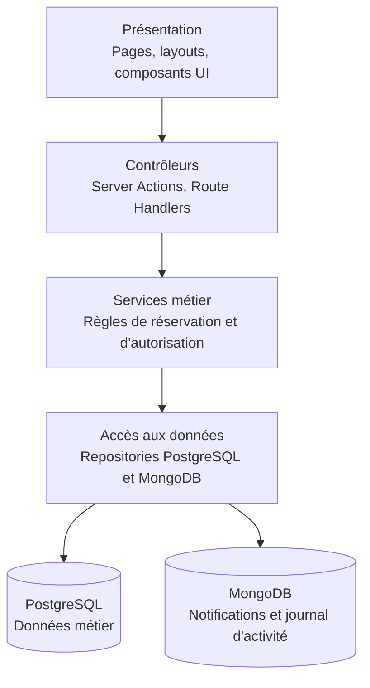

# Architecture de l'application L'Escale

## 1. Objectif

L'application L'Escale est organisée en couches afin de séparer la
présentation, le contrôle des requêtes, la logique métier et l'accès aux
données. Cette organisation facilite la maintenance, les tests et l'évolution
de l'application.

Chaque couche ne peut appeler que la couche située immédiatement en dessous.
Les composants de présentation ne doivent donc jamais accéder directement à une
base de données.

## 2. Vue d'ensemble



## 3. Présentation

La couche de présentation regroupe les éléments visibles et utilisables par
les utilisateurs :

- pages et layouts du dossier `app/` ;
- composants d'interface ;
- formulaires ;
- messages de succès et d'erreur ;
- affichage des ressources, réservations et notifications.

Cette couche collecte les actions de l'utilisateur et affiche les résultats.
Elle ne contient pas les règles métier centrales et n'interroge pas directement
les repositories.

## 4. Contrôleurs

Les contrôleurs sont implémentés avec les Server Actions et les Route Handlers
de Next.js.

Ils sont responsables de :

- vérifier l'authentification ;
- vérifier le rôle et les droits sur la ressource concernée ;
- valider les données reçues avec Zod ;
- appeler le service métier correspondant ;
- transformer le résultat en réponse exploitable par l'interface.

Les contrôleurs ne doivent pas contenir les règles métier complexes et ne
doivent pas interroger directement PostgreSQL ou MongoDB.

## 5. Services métier

Les services métier regroupent les règles fonctionnelles de l'application.
Ils doivent rester indépendants de Next.js afin d'être testés avec Vitest sans
démarrer l'application web.

Les services prévus comprennent notamment :

- service de réservation ;
- service de gestion du catalogue ;
- service de validation des demandes ;
- service d'annulation ;
- service de gestion des comptes ;
- service de maintenance ;
- service de notification ;
- service de journalisation des actions importantes.

Le service de réservation applique notamment les règles R1 à R8 :

- quota par catégorie ;
- durée maximale ;
- délai de réservation ;
- délai d'annulation ;
- périodes de maintenance ;
- refus motivé ;
- désactivation d'un compte ;
- expiration automatique des demandes non traitées.

Les services reçoivent leurs dépendances, notamment les repositories, afin de
faciliter les tests et de limiter leur couplage aux détails techniques.

## 6. Accès aux données

Les repositories sont les seuls composants autorisés à interroger les bases de
données.

### PostgreSQL

PostgreSQL stocke les données métier :

- utilisateurs et rôles ;
- ressources ;
- réservations ;
- périodes de maintenance.

L'accès s'effectue avec l'ORM retenu dans un ADR. Les migrations et le script
de seed seront versionnés dans le dépôt.

### MongoDB

MongoDB stocke les données transversales :

- notifications ;
- journal d'activité.

Les repositories MongoDB sont séparés des repositories PostgreSQL afin de
respecter les responsabilités de chaque base.

## 7. Règles de dépendance

Les dépendances autorisées sont :

```text
Présentation
    ↓
Contrôleurs
    ↓
Services métier
    ↓
Repositories
    ↓
Bases de données
```

Les dépendances suivantes sont interdites :

- un composant d'interface vers un repository ;
- un composant d'interface vers une base de données ;
- un service métier vers une API Next.js ;
- un contrôleur vers PostgreSQL ou MongoDB sans passer par un service ;
- un repository vers un composant de présentation.

La CI devra vérifier les règles d'import entre les couches.

## 8. Sécurité et validation

Les contrôles de sécurité sont réalisés côté serveur :

- l'authentification est vérifiée avant toute action protégée ;
- les rôles sont vérifiés selon l'action demandée ;
- la propriété des réservations est vérifiée ;
- toutes les données entrantes sont validées avec Zod ;
- les mots de passe sont stockés sous forme de hash ;
- les secrets sont fournis par les variables d'environnement ;
- les erreurs ne doivent pas divulguer de données sensibles.

Le contrôle d'accès ne doit jamais dépendre uniquement de l'affichage ou du
masquage d'un bouton dans l'interface.

## 9. Éco-conception

Les choix suivants sont prévus pour limiter les ressources consommées :

- pagination des listes de ressources, réservations et journaux ;
- limitation de la taille et du poids des images ;
- chargement des données uniquement lorsque cela est nécessaire ;
- limitation du nombre de requêtes inutiles ;
- index adaptés aux recherches et aux contrôles de disponibilité ;
- absence de rafraîchissement automatique non justifié ;
- messages et interfaces simples afin de limiter le poids des pages.

Ces choix seront vérifiés et complétés au cours de l'implémentation.

## 10. Arborescence cible

```text
app/
  pages, layouts et composants de présentation
components/
  composants d'interface réutilisables
lib/
  services/
  repositories/
    postgres/
    mongodb/
  validations/
  permissions/
prisma/
  schema.prisma
  migrations/
  seed.ts
tests/
  unit/
  integration/
  e2e/
```
