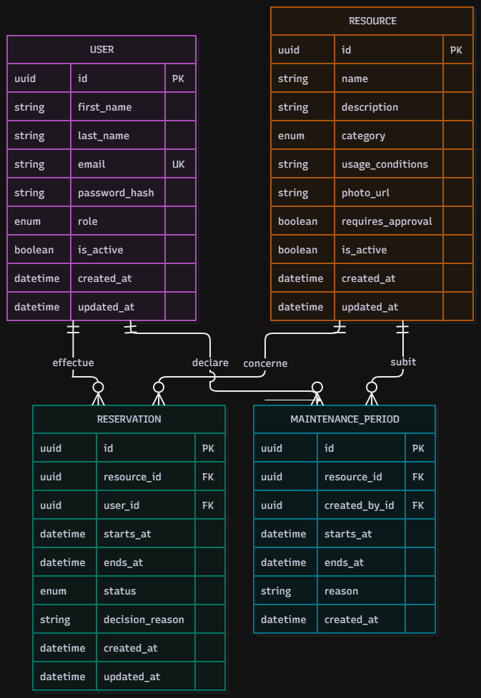

# Modèle de données — L'Escale

## 1. Objectif

Ce document présente les principales données nécessaires au fonctionnement de
l'application L'Escale. Il servira de base au modèle conceptuel, au modèle
logique, au schéma PostgreSQL et aux repositories de l'application.

Les données métier sont stockées dans PostgreSQL. Les notifications et le
journal d'activité sont stockés dans MongoDB, conformément aux contraintes
techniques du cahier des charges.

## 2. Schéma relationnel PostgreSQL



### Blocs MongoDB

Les deux collections MongoDB complètent le schéma relationnel présenté dans
l'image ci-dessus :

```text
notifications
---------------
_id
userId
type
title
message
readAt
createdAt
```

```text
activity_logs
-------------
_id
authorId
action
targetType
targetId
metadata
createdAt
```

Les champs `userId`, `authorId` et `targetId` référencent les identifiants
PostgreSQL sous forme de chaînes. Il s'agit de références applicatives et non
de relations SQL.

Les relations entre les tables PostgreSQL représentées dans le schéma sont les
suivantes :

- un utilisateur peut effectuer plusieurs réservations ;
- une ressource peut être concernée par plusieurs réservations ;
- une ressource peut avoir plusieurs périodes de maintenance ;
- un utilisateur gestionnaire ou administrateur peut déclarer plusieurs
  périodes de maintenance.

## 3. Entités PostgreSQL

### User

Représente une personne autorisée à utiliser l'application.

Attributs proposés :

- `id` : identifiant unique ;
- `firstName` : prénom ;
- `lastName` : nom ;
- `email` : adresse e-mail unique ;
- `passwordHash` : mot de passe haché ;
- `role` : rôle de l'utilisateur ;
- `isActive` : indique si le compte est actif ;
- `createdAt` : date de création ;
- `updatedAt` : date de dernière modification.

Un utilisateur possède un seul rôle principal parmi `MEMBER`, `MANAGER` et
`ADMIN`. Le profil visiteur ne possède pas de compte.

### Resource

Représente une ressource réservable.

Attributs proposés :

- `id` : identifiant unique ;
- `name` : nom de la ressource ;
- `description` : description ;
- `category` : catégorie de la ressource ;
- `usageConditions` : conditions d'utilisation ;
- `photoUrl` : URL de la photo, facultative ;
- `requiresApproval` : indique si une validation est obligatoire ;
- `isActive` : indique si la ressource est proposée dans le catalogue ;
- `createdAt` : date de création ;
- `updatedAt` : date de dernière modification.

Les catégories prévues sont les salles, le studio, le véhicule et le matériel.
La liste et les règles associées devront être confirmées par le client.

### MaintenancePeriod

Représente une période pendant laquelle une ressource est indisponible.

Attributs proposés :

- `id` : identifiant unique ;
- `resourceId` : ressource concernée ;
- `startsAt` : début de la maintenance ;
- `endsAt` : fin de la maintenance ;
- `reason` : motif de la maintenance ;
- `createdById` : gestionnaire à l'origine de la déclaration ;
- `createdAt` : date de création.

Une période de maintenance ne doit pas avoir une fin antérieure à son début.

### Reservation

Représente une réservation ou une demande de réservation.

Attributs proposés :

- `id` : identifiant unique ;
- `resourceId` : ressource réservée ;
- `userId` : adhérent demandeur ;
- `startsAt` : début du créneau ;
- `endsAt` : fin du créneau ;
- `status` : état de la réservation ;
- `decisionReason` : motif de refus, facultatif sauf en cas de refus ;
- `createdAt` : date de création ;
- `updatedAt` : date de dernière modification.

Les statuts proposés sont :

- `PENDING` : demande en attente de validation ;
- `CONFIRMED` : réservation confirmée ;
- `REJECTED` : demande refusée ;
- `CANCELLED` : réservation annulée ;
- `EXPIRED` : demande non traitée avant le début du créneau.

Les réservations confirmées et les demandes en attente doivent être prises en
compte pour empêcher les chevauchements et appliquer le quota.

### Role

Le rôle peut être représenté par une valeur contrôlée dans `User` ou par une
table dédiée. Le choix final sera documenté dans un ADR.

Valeurs fonctionnelles attendues :

- `MEMBER` : adhérent ;
- `MANAGER` : gestionnaire ;
- `ADMIN` : administrateur.

## 4. Collections MongoDB

Les collections MongoDB ne possèdent pas de relation SQL directe avec
PostgreSQL. Les champs `userId`, `authorId` et `targetId` référencent les
identifiants PostgreSQL sous forme de chaînes.

### Collection `notifications`

Cette collection contient les notifications envoyées aux utilisateurs.

| Champ       | Type                        | Description                               |
| ----------- | --------------------------- | ----------------------------------------- |
| `_id`       | `ObjectId`                  | Identifiant MongoDB du document           |
| `userId`    | `UUID` sous forme de chaîne | Identifiant de l'utilisateur destinataire |
| `type`      | `string`                    | Type de notification                      |
| `title`     | `string`                    | Titre affiché                             |
| `message`   | `string`                    | Contenu de la notification                |
| `readAt`    | `datetime` ou `null`        | Date de lecture                           |
| `createdAt` | `datetime`                  | Date de création                          |

Exemple :

```json
{
  "_id": "ObjectId",
  "userId": "uuid-utilisateur",
  "type": "RESERVATION_UPDATED",
  "title": "Demande acceptée",
  "message": "Votre demande a été validée.",
  "readAt": null,
  "createdAt": "2026-10-07T10:00:00Z"
}
```

Types d'événements à confirmer :

- demande créée ;
- demande validée ;
- demande refusée ;
- réservation annulée ;
- réservation annulée par une maintenance ;
- compte désactivé ;
- demande automatiquement expirée.

### Collection `activity_logs`

Cette collection contient les actions importantes réalisées dans l'application.

| Champ        | Type                        | Description                         |
| ------------ | --------------------------- | ----------------------------------- |
| `_id`        | `ObjectId`                  | Identifiant MongoDB du document     |
| `authorId`   | `UUID` sous forme de chaîne | Identifiant de l'auteur de l'action |
| `action`     | `string`                    | Action réalisée                     |
| `targetType` | `string`                    | Type de l'objet concerné            |
| `targetId`   | `UUID` sous forme de chaîne | Identifiant de l'objet concerné     |
| `metadata`   | `object`                    | Informations complémentaires        |
| `createdAt`  | `datetime`                  | Date de création                    |

Exemple :

```json
{
  "_id": "ObjectId",
  "authorId": "uuid-gestionnaire",
  "action": "RESERVATION_CANCELLED",
  "targetType": "Reservation",
  "targetId": "uuid-reservation",
  "metadata": {
    "reason": "Maintenance de la ressource"
  },
  "createdAt": "2026-10-07T10:00:00Z"
}
```

Le journal doit permettre d'identifier l'auteur, l'action, la cible et la date.
Sa conservation est limitée à un an selon l'expression de besoin.

## 5. Relations principales

| Relation                     | Cardinalité   | Description                                                                            |
| ---------------------------- | ------------- | -------------------------------------------------------------------------------------- |
| User — Reservation           | 1 à plusieurs | Un adhérent peut avoir plusieurs réservations                                          |
| Resource — Reservation       | 1 à plusieurs | Une ressource peut être réservée plusieurs fois sur des créneaux différents            |
| Resource — MaintenancePeriod | 1 à plusieurs | Une ressource peut avoir plusieurs périodes de maintenance                             |
| User — MaintenancePeriod     | 1 à plusieurs | Un gestionnaire peut déclarer plusieurs maintenances                                   |
| User — Notification          | 1 à plusieurs | Un utilisateur reçoit plusieurs notifications                                          |
| User — ActivityLog           | 1 à plusieurs | Un gestionnaire ou administrateur peut être l'auteur de plusieurs actions journalisées |

## 6. Contraintes d'intégrité

- l'adresse e-mail d'un utilisateur est unique ;
- `startsAt` est strictement antérieur à `endsAt` ;
- une réservation référence une ressource existante ;
- une réservation référence un utilisateur existant ;
- une maintenance référence une ressource existante ;
- une maintenance référence un gestionnaire ou administrateur existant ;
- une réservation refusée possède un motif ;
- une réservation en attente concerne une ressource nécessitant une validation ;
- un compte désactivé ne peut plus créer de réservation ;
- les chevauchements doivent être empêchés côté serveur et protégés contre les
  demandes simultanées ;
- les index nécessaires aux recherches et aux contrôles de disponibilité seront
  définis dans le modèle physique.
