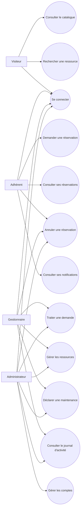
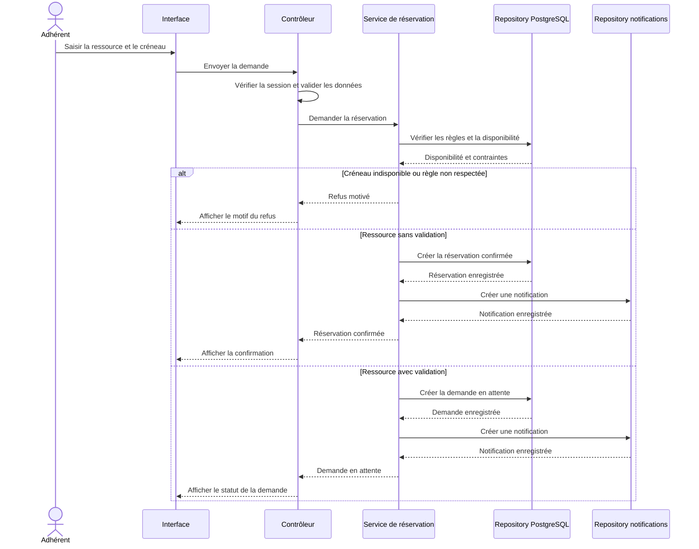
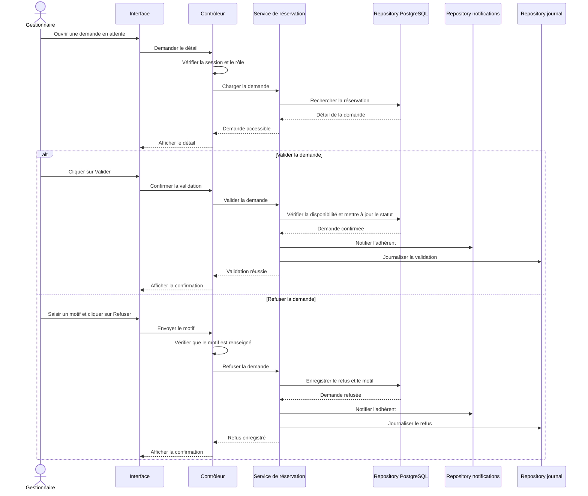

# Diagrammes fonctionnels — L'Escale

## Diagramme de cas d'utilisation

## Séquence — Demander une réservation

## Séquence — Traiter une demande de réservation

## Règles de représentation

- Les acteurs représentent les profils fonctionnels de l'application.
- Les contrôleurs vérifient l'authentification, les rôles et les données
  entrantes.
- Les services appliquent les règles métier.
- Les repositories sont les seuls composants qui accèdent aux bases de données.
- Les notifications et le journal sont enregistrés après la réussite de
  l'opération métier principale.
